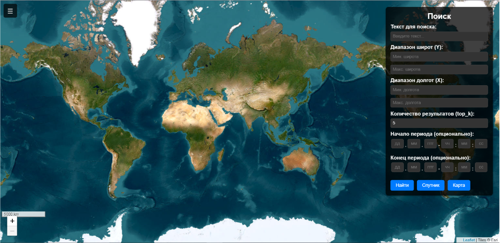
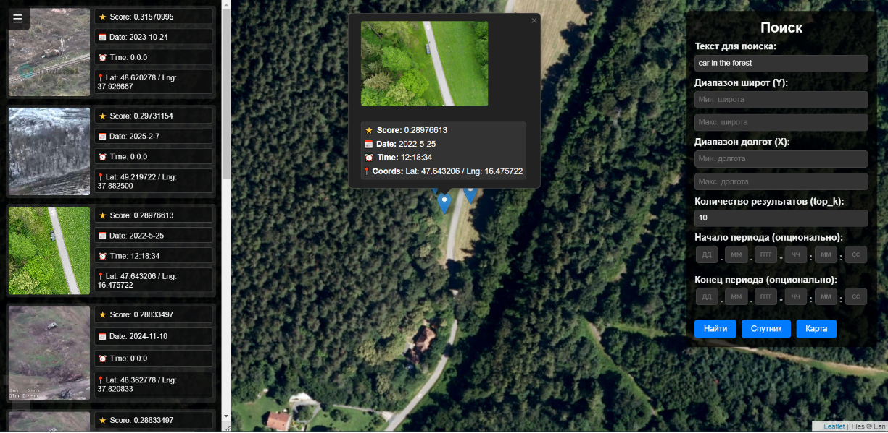
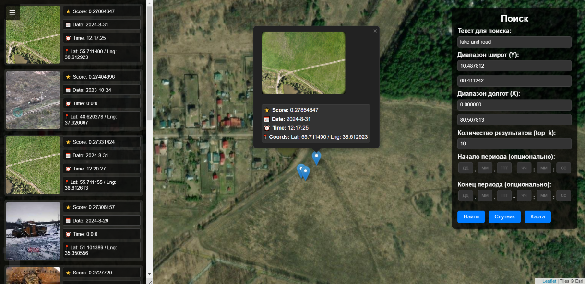
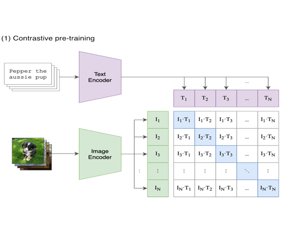
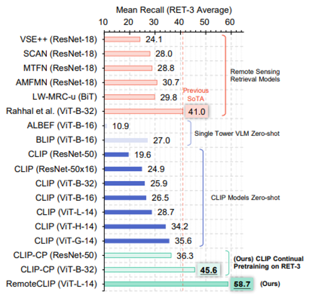
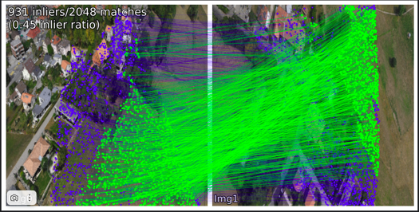
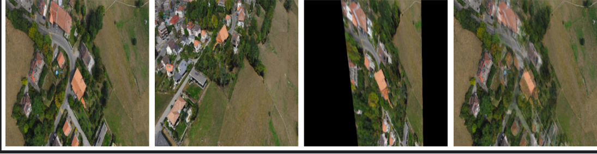
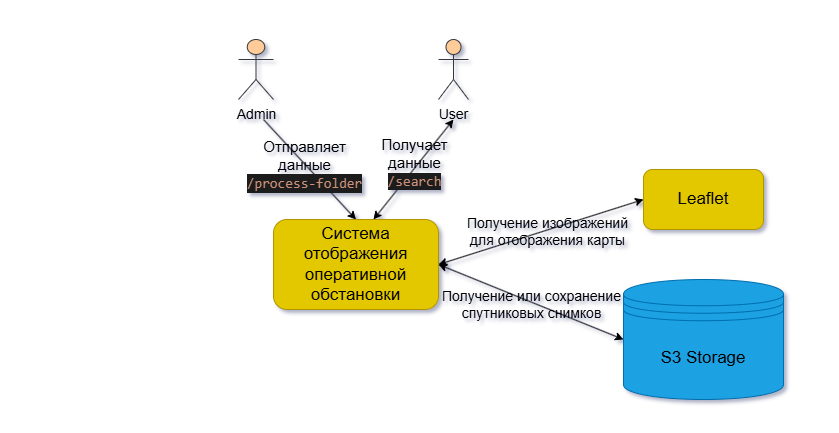
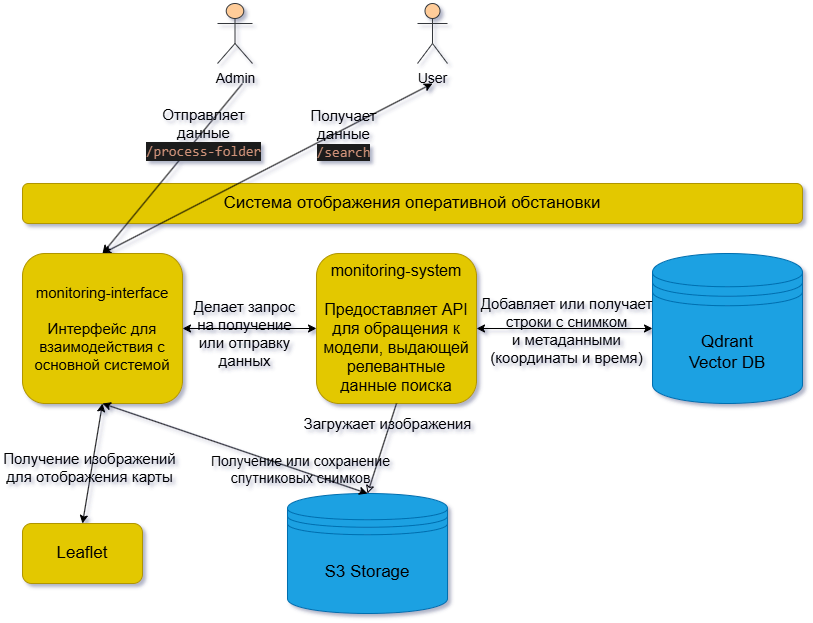
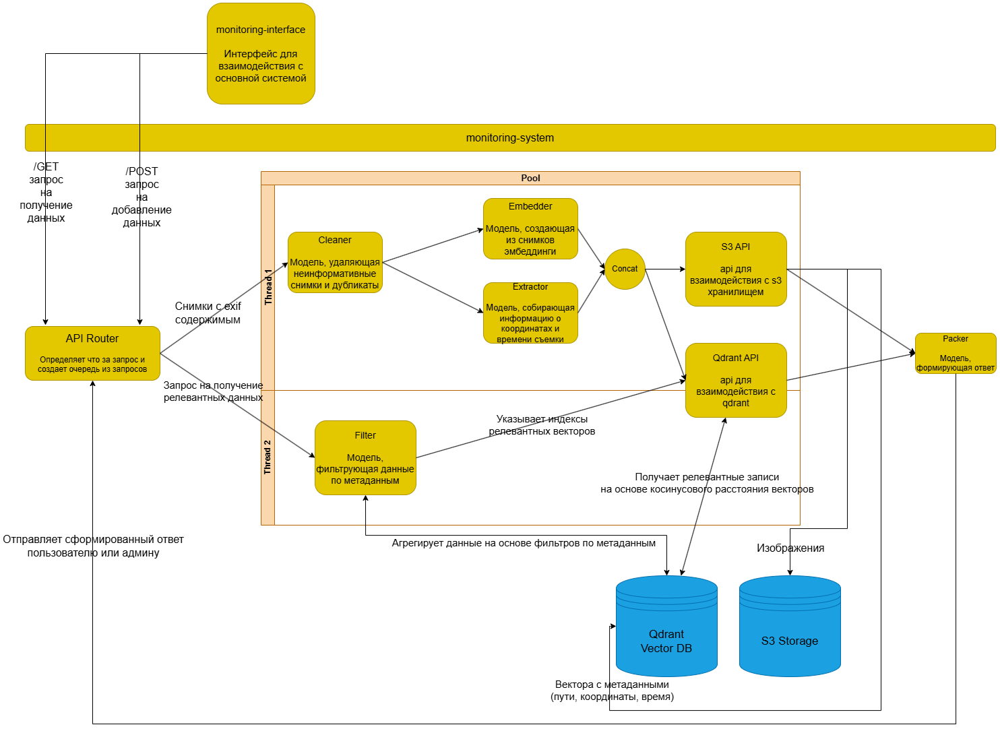

# Operational Situation Display System

**Operational Situation Display System** — система, предназначенная для сокращения времени принятия решений и повышения оперативности целеуказания за счёт предоставления точных данных о местоположении, перемещении и действиях объектов интереса в реальном времени.

Модель позволяет **находить любые объекты интереса на основе текстового описания**, а также **уточнять результаты по координатам и временным промежуткам**.

---

## 🎯 Цель проекта

Сократить время принятия решений и ускорить целеуказание, предоставляя в реальном времени точные координаты, время и действия любого объекта интереса — через визуально удобный модуль для быстрого поиска.

Для этого реализованы:

* Сбор и агрегация данных в реальном времени
* Быстрая обработка и хранение информации
* Интуитивная карта и панель управления
* Моментальный поиск и фильтрация объектов
* Удобное отображение результатов поиска

---

## 🚨 Актуальность

Система особенно важна в следующих сферах:

1. **Безопасность и реагирование на угрозы**
2. **Мониторинг инфраструктуры**
3. **Поиск изменений на местности**
4. **Поиск и спасение людей**

---

## ⚠️ Проблематика

* Огромные объёмы данных
* Медленная скорость обработки информации
* Снижение концентрации внимания операторов
* Риск ошибок из-за человеческого фактора
* Необходимость автоматизации

---

## ✅ Результат

Создан программный модуль с интуитивно понятным интерфейсом, позволяющий в режиме реального времени находить и визуализировать **любые объекты интереса на основе текстового описания**, с возможностью уточнения **по координатам и времени**.
Это обеспечивает **оперативный доступ к точным данным** о местоположении, перемещениях и действиях целей и **существенно сокращает время принятия решений**.

---

## 🗂 Типы данных (датасет)

В системе используется набор разнородных данных, охватывающий различные источники визуальной информации:

* 🛰 **Спутниковые снимки**
* 🚁 **Видеоряды, снятые дронами**
* 📷 **Видео и снимки с видеокамер наблюдения**

Эти данные автоматически обрабатываются, очищаются от дубликатов и индексируются для последующего поиска.

---

## 📦 Структура проекта

```bash
operationalSituationDisplaySystem/
├── README.md
├── monitoring-interface/
│   ├── Dockerfile
│   ├── docker-compose.yaml
│   ├── requirements.txt
│   ├── app.py
│   ├── templates/
│   │   └── index.html
│   └── static/
│       ├── style.css
│       └── script.js
└── monitoring-system/
    ├── Dockerfile
    ├── docker-compose.yaml
    ├── environment.yml
    ├── requirements.txt
    ├── app.py
    ├── datasets/
    ├── image-matching-models/
    ├── weights/
    │   ├── FastSAM-x.pt
    │   └── RemoteCLIP-ViT-B-32.pt
    └── src/
        ├── duplicate/
        ├── embedding/
        └── retrieval/
            ├── base_client.py
            ├── indexer.py
        ├── processing/
        │   ├── folder_scanner.py
        │   ├── image_processor.py
        │   └── batch_processor.py
        └── utils/
```

---

## 🚀 Возможности

* **Поиск по текстовому описанию** — векторный поиск через Qdrant
* **Фильтрация по координатам** — ручной ввод или выделение области на карте
* **Фильтрация по времени** — поиск по заданному интервалу
* **Ограничение количества результатов**
* **Удаление дубликатов изображений**
* **Интеграция с Yandex Object Storage (S3 API)**
* **Микросервисная архитектура с Docker-контейнерами**

---

## ⚙️ Установка и запуск

### 1. Клонируйте репозиторий

```bash
git clone https://gitlab.mai.ru/DADegtyarev/operationalSituationDisplaySystem.git
cd operationalSituationDisplaySystem
```

### 2. Создайте общую сеть Docker

```bash
docker network create retrieve_network
```

### 3. Запустите backend

```bash
cd monitoring-system
docker-compose up --build -d
```

### 4. Запустите интерфейс

```bash
cd monitoring-interface
docker-compose up --build -d
```

### 5. Доступ к сервисам

* UI: [http://localhost:8333](http://localhost:8333)
* API: [http://localhost:8000](http://localhost:8000)

---

## ☁️ Настройка AWS S3

Для корректной работы с хранилищем необходимо:

1. Пройти авторизацию:

```bash
aws configure
```

2. Указать:

* AWS Access Key ID
* AWS Secret Access Key
* Регион (например: `ru-central1`)
* Формат вывода (`json`)

3. Загрузите изображения в бакет:

```bash
aws s3 cp ./local-images/ s3://remote-sensing-storage/ --recursive
```

---

## 📥 Использование

### Загрузка и обработка изображений из S3

```python
import requests

url = "http://localhost:8000/process-folder"
params = {
    "folder_path": "s3://remote-sensing-storage",
    "batch_size": 3
}

response = requests.post(url, params=params)

print("Статус-код:", response.status_code)
print("Ответ сервера:", response.text)
```

▶️ **Эта команда запускает процесс добавления изображений из S3-хранилища в векторную базу данных.**

---

## 🖼 Интерфейс

**Начальный экран:**  


**Результаты поиска (пример 1):**  


**Результаты поиска (пример 2):**  


**Интерфейс поиска — нажмите на изображение, чтобы посмотреть демонстрационное видео:**  
[](./for_readme/video/interface.mp4)

---

## 🧠 Используемые инструменты

### 1. **Embedder: RemoteCLIP ViT-B/32**

> Используется для создания эмбеддингов изображений и текстов в едином векторном пространстве.

* Модификация CLIP под задачи наблюдения
* Архитектура: ViT-B/32
* Метрика: косинусная близость
* Позволяет сопоставлять любые изображения и текстовые описания

**Принцип обучения CLIP:**  
  


**Метрика модели:**  


---

### 2. **Duplicate Detector: SuperPoint + LightGlue**

> Находит и удаляет визуально схожие изображения до индексации.

* SuperPoint — извлечение ключевых точек
* LightGlue — сопоставление дескрипторов
* Быстро, устойчиво к деформациям и перспективе
* Опционально заменяемый на более точные, но медленные алгоритмы (например, SuperGlue)

**Пример мэтчинга:**  


**Результат удаления дубликатов:**  


---

### 3. **Векторная база данных: Qdrant**

> Хранение и поиск эмбеддингов изображений и описаний.

* Тип: нейровекторная база
* Фильтрация по координатам, времени и метаданным
* Поддержка hot reload, REST API, масштабируемость
* Быстрая интеграция с Python

---

## 🧩 Архитектура (C4)

* **Уровень 1 – Контекст:**  
  

* **Уровень 2 – Контейнеры:**  
  

* **Уровень 3 – Компоненты `monitoring-system`:**  
  

---

## 📄 Лицензия

Проект распространяется под лицензией **MIT**. См. файл `LICENSE`.
